# Screenshots

Every image here is captured from a real library by
[`scripts/capture-screenshots.js`](../scripts/capture-screenshots.js). To refresh
them after a UI change, run:

```bash
node scripts/capture-screenshots.js
```

The script starts its own server against a copy of your `config.json` with
Secret mode stripped out, and aborts rather than saving a shot if any Secret-mode
control would land inside the frame. Nothing private is in these images.

The server it runs binds port 5099 rather than the usual 5089, which is why the
Settings screenshot shows that port.

## Import Generated Art — the library grid

Every NPC the generator has rolled, with status badges, role categories and the blue **New** tag on anything generated since you last looked.

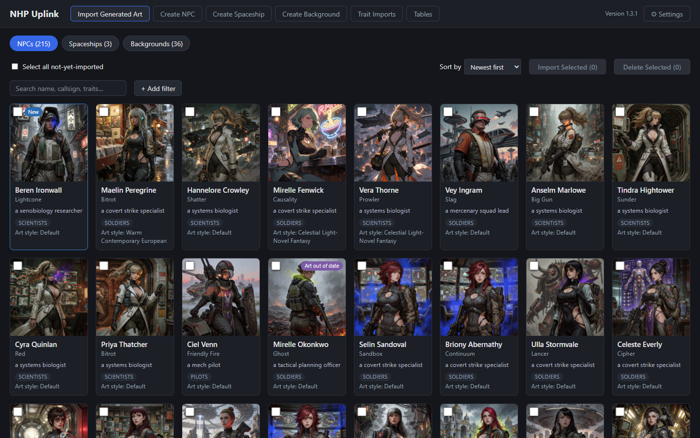

## An NPC detail sheet

Portrait and token side by side, the prompts that produced them, and the trait table whose **Portrait only** / **Token only** / **Animated only** pills say which image each trait actually reaches.

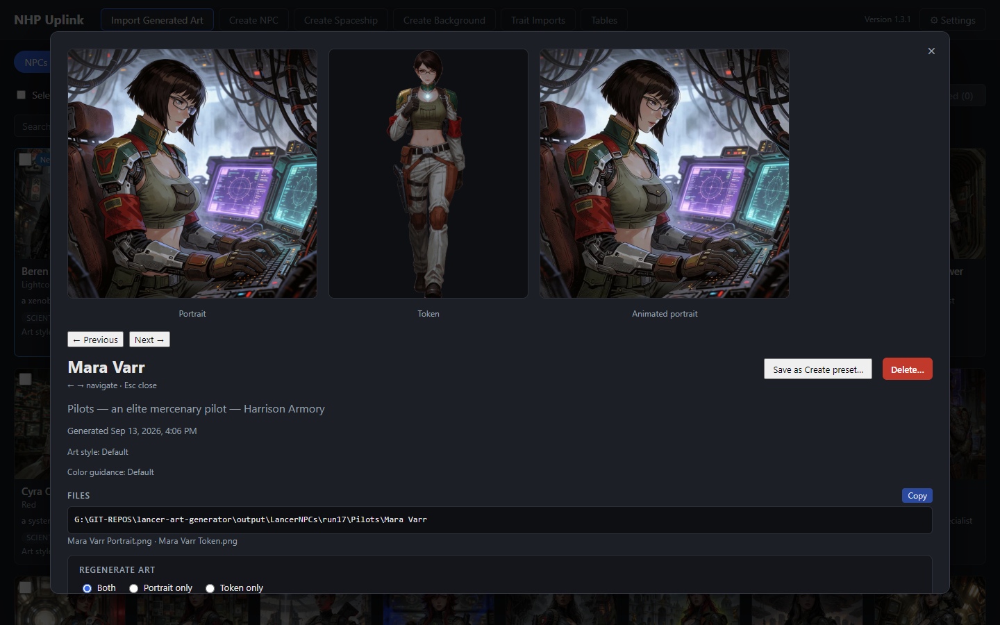

## The trait table and its scope pills

Every rolled trait, with **Re-roll** and **Set…** on each. The pills say which image a trait actually reaches, and the buttons take the pill's colour, so changing one of them is visibly a change to one image.

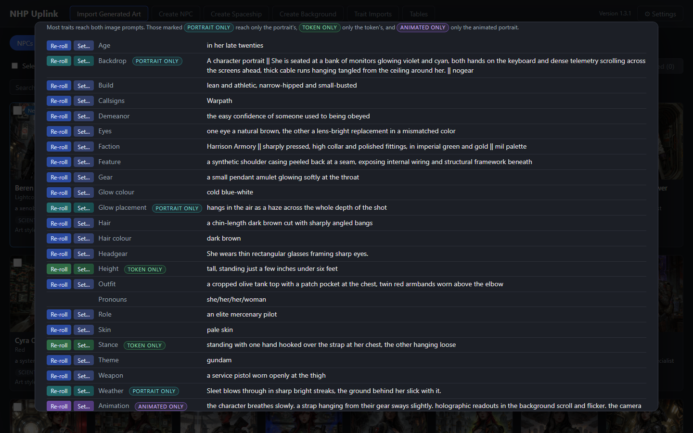

## 3D model panel

Rebuilds the NPC from a fresh A-pose render into a shell GLB, a print STL and four turnaround PNGs, shown here as thumbnails once the build has landed.

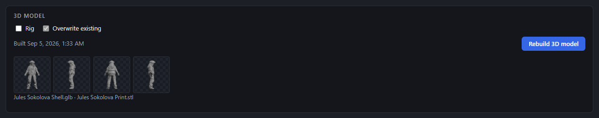

## Animated portrait panel

Turns the portrait into a looping WebP through Wan 2.2. The motion is the **Animation** row of the trait table, so this panel only shows the choice, the seed and the button.

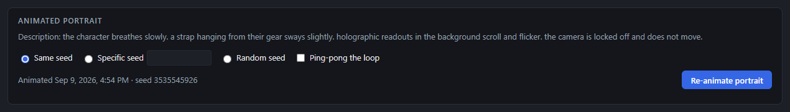

## Expressions panel

Static WebP sprites for SillyTavern's Character Expressions extension: 28 default labels in generator order, custom labels as chips, and the generated sprites below.

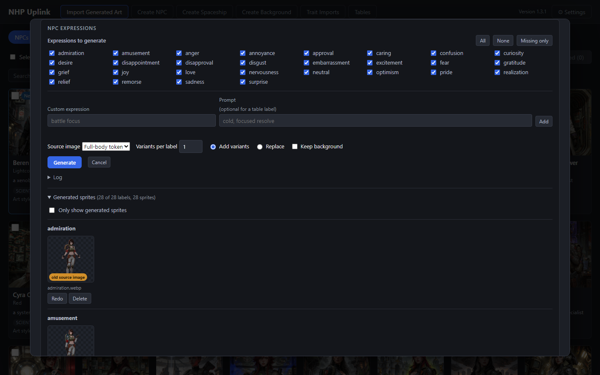

## Create NPC — trait overrides

A form over `generate-npc.py`'s roll options. Each override gets a search box that narrows the table's own bullets, a count of what matched, and the full bullet printed below exactly as it will be sent — flags included.

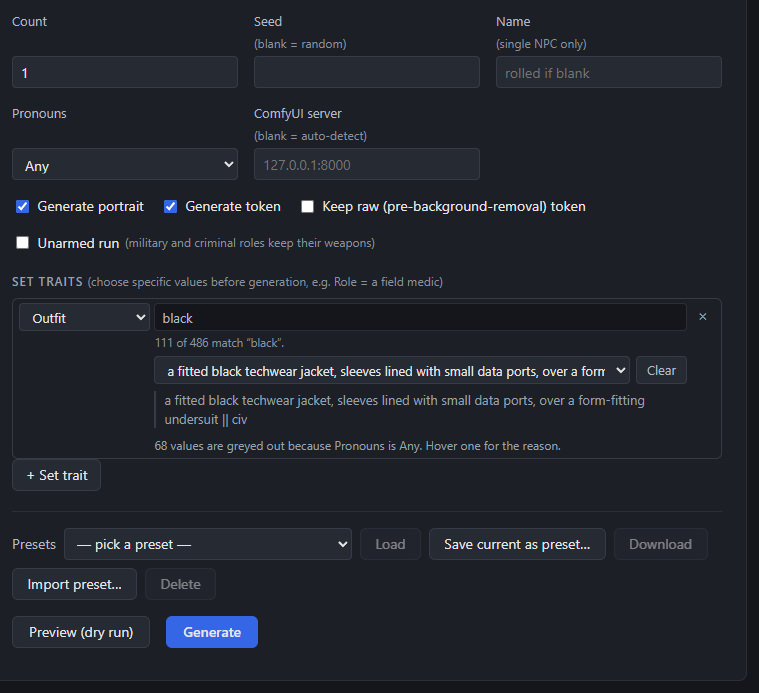

## Create Spaceship

The same form over `generate-spaceship.py`. The whole ship half of the app hides itself when that script is not on disk, rather than offering buttons that fail when clicked.

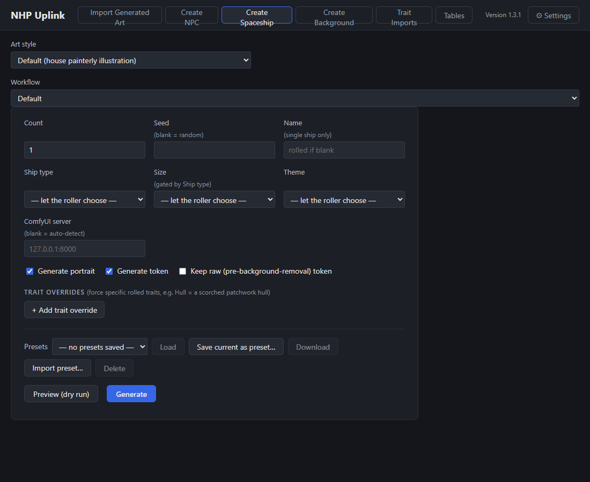

## Create Background

Renders scene art from the generator's background catalogues — or from rolled dynamic traits — and animates any still into a loop.

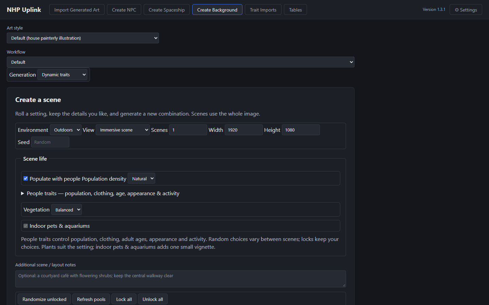

## Backgrounds in the library grid

Rendered scenes are wide rather than square and carry a **Loop** badge when an animated loop sits beside the still.

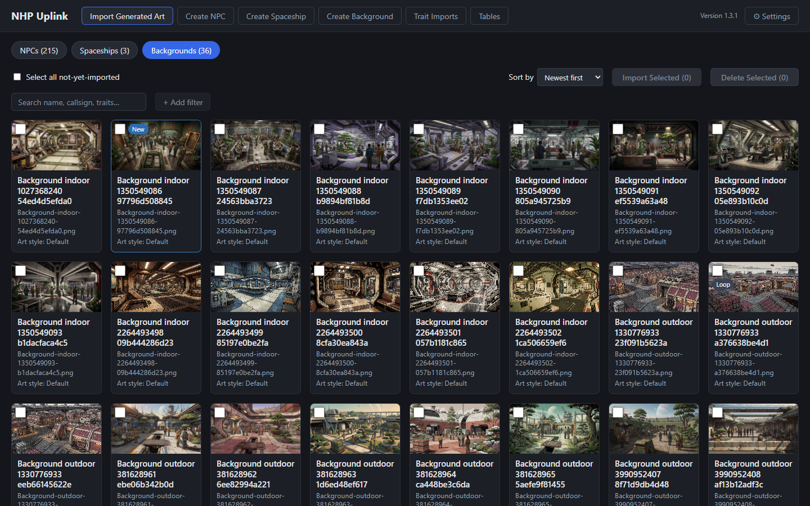

## Trait Imports

Reference-image trait candidates staged by the generator's `npc-trait-import` skill, each beside the image it was read from, ready to accept into a roll table.

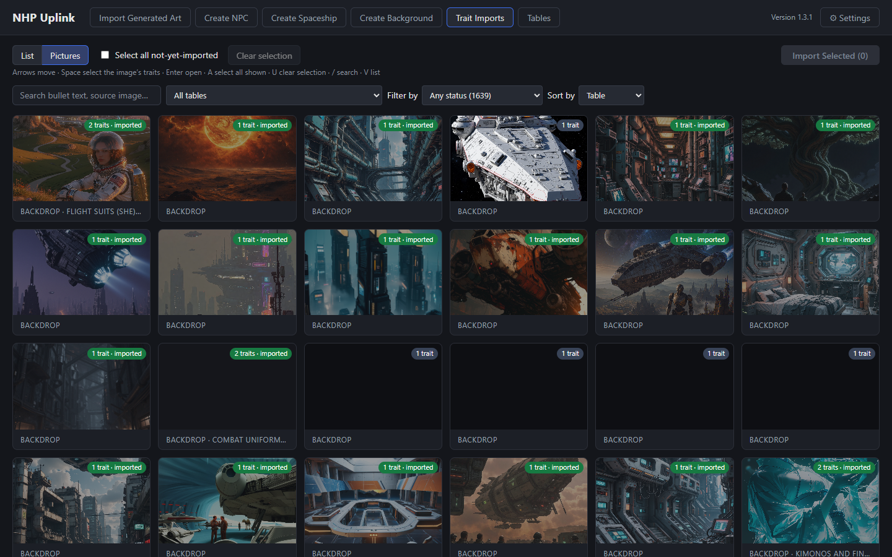

## Tables — the roll tables, edited in place

Every bullet in every roll table, with its weight, its `||` flags, whether it is disabled, and the sampled percentage it actually comes up at.

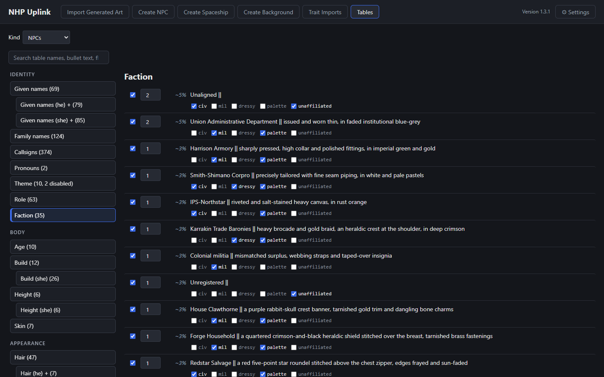

## Settings

Every config key, grouped by area, with each blank field's default or derived path in grey and a warning on any set path that does not exist.

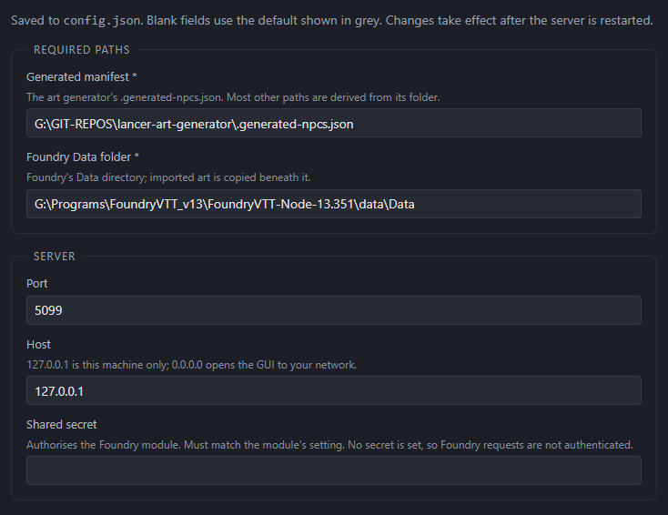

## The same library on a phone

The layout collapses to a single column, the filters fold into a disclosure and the import actions become a bottom action bar.

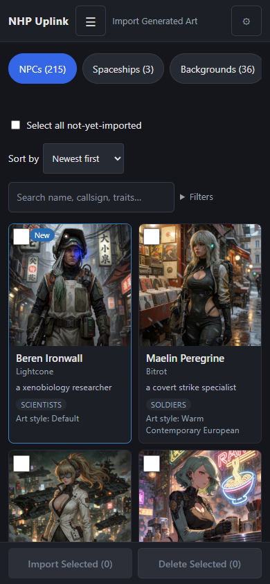
